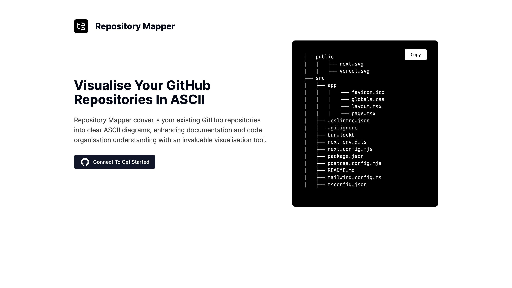

# Repository Mapper: Visualise Your GitHub Repositories In ASCII

<br>



## Getting Started

The essential procedures required for initiating and configuring the project within your local environment.

### Prerequisites

1. Upgrade the Node Package Manager (npm) to the latest release version.

   ```sh
   npm install -g npm@latest
   ```

### Installation

1. Clone the repository and retrieve it onto your local machine.

   ```sh
   git clone https://github.com/adshyanmatheetharan/Repository-Mapper.git
   ```

2. Navigate to the frontend folder directory.

   ```sh
   cd frontend
   ```

3. Install the required Node Package Manager (npm) packages and dependencies.

   ```sh
   npm install
   ```

4. Enter your environmental variables within the `.env` file.

    ```js
    GITHUB_ID="Enter Your GitHub Client Identification"
    GITHUB_SECRET="Enter Your GitHub Client Secret"
    NEXTAUTH_URL="Enter Your Next-Auth URL"
    NEXTAUTH_SECRET="Enter Your Next-Auth Secret"
    ```
5. Launch the application via localhost, and then access it through the browser.

   ```sh
   npm run dev
   ```

## License

This repository is distributed under the MIT License. See `LICENSE` for additional information.
